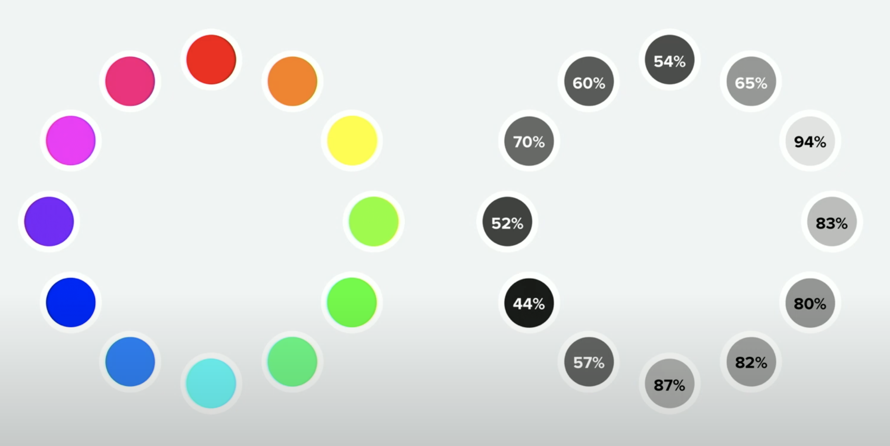
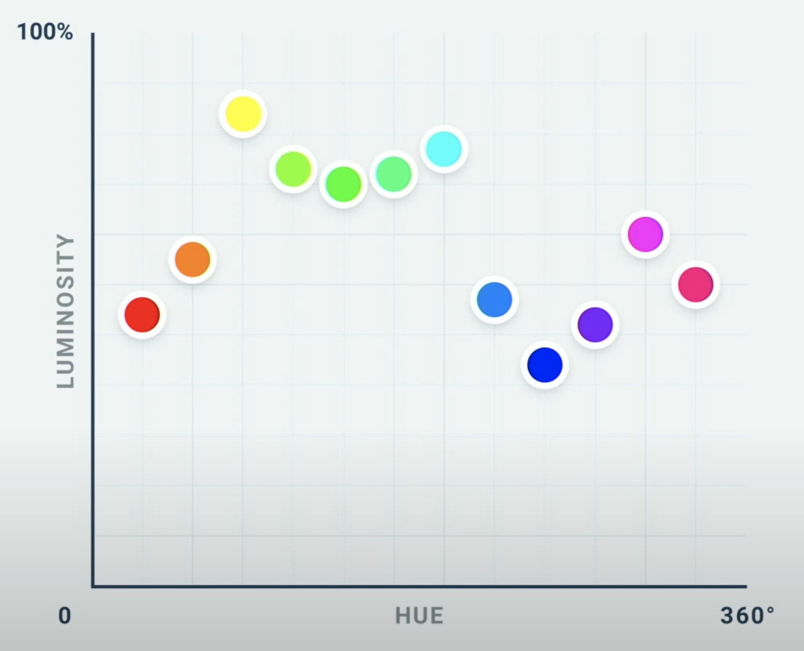

# UI Design Notes

## UI Design Fundamentals
1. Color
2. Contrast
3. Whitespace
4. Typography
5. Alignment
6. Visual Hierarchy
7. Scale
8. Consistency

### Hero Section
The first section of a site, often includes:
- Headline
- Sub-headline
- Image or graphic of some type
- Call to action

## Color

### General
- Be aware of target demographic, different colors can mean different things to different groups
- In general, lighter elements feel closer and darker elements feel further away
- To make something feel inset on a light background, give it an off-white color (be careful not to make it look like a disabled state)
- Break up sections of webpage by rotating different background colors (ex: white, light gray, dark gray, brand color)
- Prevent clashing colors ie: background of avatar/headshot images on colored background by adding a white/black border around the image

### Perceived Brightness
- Every hue has an inherant perceived brightness - luminance

>
>

- Normally, when you want to change how light a color looks, you change the lightness value, however this can result in a loss of saturation
  - Because hues have different perceived brightnesses, you can change the brightness of a color by rotating the hue to the nearest bright color
  - This trick works well with text on colored backgrounds

### Color Psychology:
- Black: luxury, sophistication, elegance
- White: 
- Red: error
- Yellow: happy
- Orange:
- Green: wealth, nature, growth, success
- Blue: intelligence
- Purple:

## Contrast

### General
- Gray text looks off on a colored background
  - We want the text to look more like the background color than gray
  - Take HSB picker and add a little saturation of the background color

## Whitespace
<todo>

## Typography / Fonts

### General
- Italics for quotes gives more of a conversational tone

## Alignment

### General
- Don't fall into trap of centering everything
- Centering is better suited for headlines and short bits of text
- Left alignment is much more readable, use for larger chunks of text

## Visual Hierarchy / Scale

### General
- Semantics are secondary to hierarchy
- Use color and weight (not only size), to indicate hierarchy
- You don't need to blow up the size of every title, sometimes proximity to other elements alone is enough (ie: video title next to video)

### Hierarchy and Color
- De-emphasize text with lighter color (less contrast) ie: for sub-headlines or body text vs headers / titles.

## Images

### General
<todo>

### Photos
<todo>

### Illustrations / Graphics
<todo>

### Icons
- Don't blow icons beyond their intended size, ~40 pixel size should be good

## Common Issues
- When creating a light/dark theme, don't just invert the colors (for background elements) we want the same visual queues in both designs, ie: the lighest colored element in the light themed UI, should remain the lightest color element in the dark themed UI. for text you want to invert

## General Tips
- Use less borders (can try box-shadow to make an element pop / give depth)
- Try several different layout options
- Don't be afraid to enlarge images to overlap other elements
- If you have a header that breaks up nicely, can add brand color to half of it to highlight key words / incorporate brand color further
- If buttons have rounded corners, think about making other clickable items also have rounded corners, keeps consistency and gives subtle visual queue

## Sources
- [Brad Traversy - UI Design for Coders](https://www.youtube.com/watch?v=0JCUH5daCCE&t=323s)
- [Steve Schoger - How to Think Like a Visual Designer](https://www.youtube.com/watch?v=hlI6xGfBjkQ)
- [Steve Schoger - Refactoring UI | CSS Day 2019](https://www.youtube.com/watch?v=7Z9rrryIOC4&feature=youtu.be)